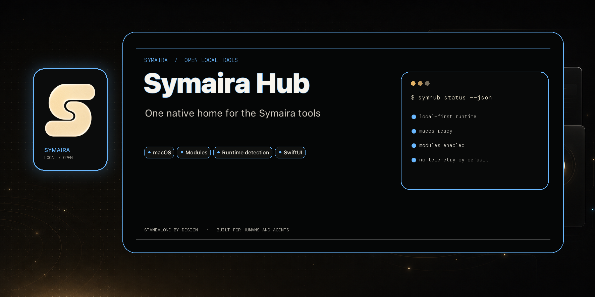
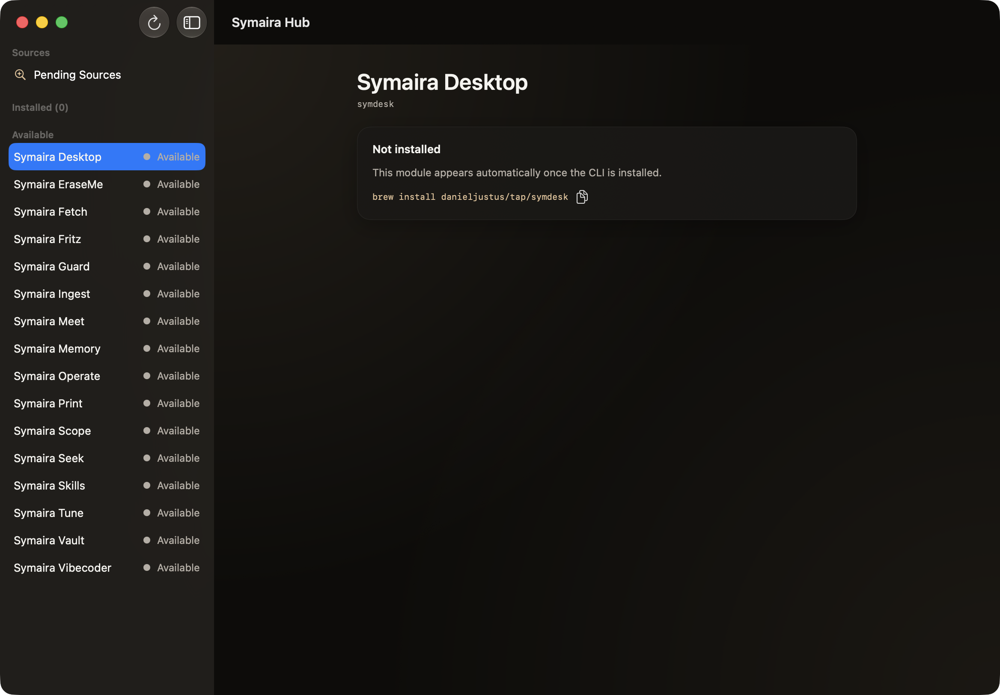

# Symaira Hub



[](https://github.com/danieljustus/symaira-hub/actions/workflows/ci.yml)
[](https://github.com/danieljustus/symaira-hub/releases)
[](LICENSE)

The native macOS control center for the [Symaira](https://symaira.com)
developer tools — one app, composed of modules that light up when the
matching CLI is installed.

- **Runtime composition, no hard dependencies:** the hub detects installed
  Symaira CLIs (bundle → PATH → Homebrew) and shows an install tile for the
  rest. Logic stays in the CLIs; `brew upgrade` updates features without a
  hub release.
- **Shared foundations:** built on [`symaira-appkit`](https://github.com/danieljustus/symaira-appkit)
  (design tokens, tool registry, binary discovery, `version --json` schema
  handshake).
- **Deliberately not included:** [Symaira Terminal](https://github.com/danieljustus/symaira-terminal)
  and Symaira EraseMe ship as standalone apps.

## Why Symaira Hub?

Managing a growing set of developer CLIs by hand means remembering install
states, launch commands and update steps per tool. Symaira Hub replaces that
with a single control center:

- **One app, zero setup burden** — install nothing extra; tools light up
  automatically when their CLI is present.
- **Features follow the CLI** — `brew upgrade <tool>` updates a module
  without a hub release, so the hub never holds your tools back.
- **Honest about what is missing** — instead of a broken button for an
  absent tool, you get the exact `brew install` command.
- **Privacy-first source discovery** — the source inspector shows metadata
  only; raw content and credentials stay with the CLI.

Not a launcher for everything: tools that are not part of the Symaira
ecosystem are out of scope, and Terminal/EraseMe intentionally remain
standalone apps.

## Install

**Download from [Releases](https://github.com/danieljustus/symaira-hub/releases)**
— grab the latest `SymairaHub-<version>.dmg`, open it, and drag the app to
Applications — or install with Homebrew:

```bash
brew install danieljustus/tap/symhub
```

## Usage



Launch Symaira Hub. The sidebar shows every tool in the Symaira registry:

- **Installed** tools appear with their detected version; clicking one opens
  its embedded module (e.g. the symscope or symseek feature UI). A
  schema-version mismatch shows the upgrade hint with the exact
  `brew upgrade <tool>` command.
- **Available** tools that are not installed show an install tile with the
  matching `brew install` command.
- **Sources** (bottom of the sidebar) opens the source inspector: candidates
  discovered by installed tools (e.g. `symmemory`, `symskills`) can be
  added, ignored, or reviewed later per source; ignored sources can be
  reset at any time.

Click the refresh button (or relaunch the app) to re-detect tools and
re-scan sources. The hub never requires a tool to be installed — missing
CLIs simply render an install tile.

```text
$ symmemory version --json
{"schema_version": 1, "version": "0.9.4"}

$ symskills discover --json
{"schema_version": 1, "candidates": [{"source_id": "skills:aws-cli", ...}]}
```

The hub consumes exactly this `--json` contract: a tool that reports a
matching `schema_version` lights up as *Installed* with its detected
version; a mismatch renders the upgrade hint with the exact
`brew upgrade <tool>` command instead of a broken module.

## Build

```bash
brew install xcodegen
xcodegen generate
xcodebuild -project SymairaHub.xcodeproj -scheme SymairaHub build
```

Requires macOS 14+, Xcode 16+.

## Status

Tool detection, dashboard, install tiles, source inspector. Per-tool
feature modules are embedded incrementally — `symscope` and `symseek` are
wired in so far — see `AGENTS.md` for the integration contract.

## License

Apache-2.0
